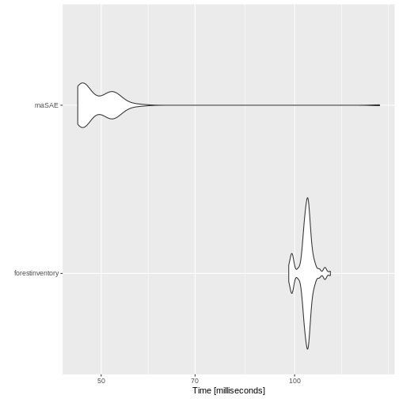
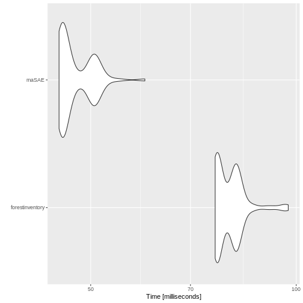
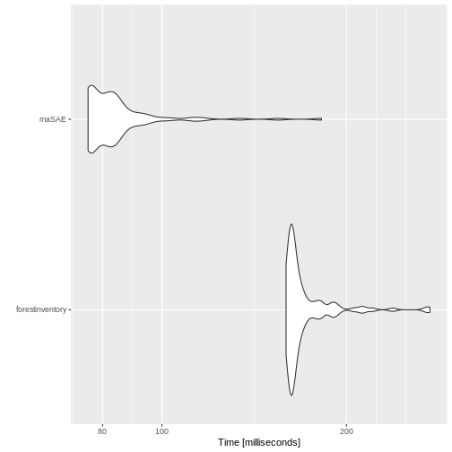

# What is this about?

In 2016, Andreas Hill published package 
[forestinventory](https://CRAN.R-project.org/package=forestinventory).
We thought about merging the packages, but never actually got to it: 
`maSAE` is S4, `forestinventory` is S3, both of us are busy doing other stuff.
So I am trying to at least compare functionality of both packages.


```r
library("forestinventory")
library("maSAE")
```

```
## 
## Attaching package: 'maSAE'
```

```
## The following object is masked from 'package:stats':
## 
##     predict
```

# Setup

I need some helpers for checking and comparing results from 
`maSAE` and `forestinventory`:


```r
clean <- function(x, which = NULL) {
    if (identical(FALSE, which)) {
        res <- as.matrix(unname(x[TRUE, TRUE]))
    } else {
        if (is.null(which)) {
            if (all(c( "small_area", "prediction", "variance") %in% names(x))) {
                res <- as.matrix(unname(x[TRUE, 1:3]))
            } else {
                res <- as.matrix(unname(x[["estimation"]][TRUE, c("area", "estimate", "g_variance")]))
            }
        } else {
            res <- as.matrix(unname(x[TRUE, c(1, grep(which, names(x)))]))
        }
    }
    return(res)
} 

compare <- function(maSAE, forestinventory, message = NULL) {
    if(! isTRUE(all.equal(clean(maSAE), clean(forestinventory), 
                          check.attributes = FALSE))) {
        message <- c("Differing results from maSAE and forestinventory: ", 
                     message)
        warning(message)
        return(FALSE)
    } 
    return(TRUE)
}
```

I use the grisons data set from `forestinventory`:


```r
data(grisons, package = "forestinventory")
```

I define regression models for simple and cluster sampling:


```r
formula.s0 <- tvol ~ mean # reduced model:
formula.s1 <- tvol ~ mean + stddev + max + q75 # full model
formula.clust.s0 <- basal ~ stade
formula.clust.s1 <- basal ~ stade + couver + melange
```

# Two-Phase 
Some data handling,
true means are taken from 
[forestinventory`s vignette](https://CRAN.R-project.org/package=forestinventory/vignettes/forestinventory_vignette.pdf). :


```r
truemeans.G <- data.frame(Intercept = rep(1, 4),
                          mean = c(12.85, 12.21, 9.33, 10.45),
                          stddev = c(9.31, 9.47, 7.90, 8.36),
                          max = c(34.92, 35.36, 28.81, 30.22),
                          q75 = c(19.77, 19.16, 15.40, 16.91))
rownames(truemeans.G) <- c("A", "B", "C", "D")

# data adjustments
s1 <- grisons[grisons[["phase_id_2p"]] == 1, ]
s2 <- grisons[grisons[["phase_id_2p"]] == 2, ]
s12 <- rbind(s1, s2)
s12$s1 <- s12$phase_id_2p %in% c(1, 2)
s12$s2 <- s12$phase_id_2p == 2

tm <- truemeans.G
tm[["smallarea"]] <- row.names(tm)
tm[["Intercept"]] <- NULL

truemeans.G.partially <- truemeans.G[, -which(names(truemeans.G) %in% c("stddev", "mean"))]
tm.partially <- tm[, -which(names(tm) %in% c("stddev", "mean"))]
```

##  No Exhaustive Auxiliary Information

This is the estimation given on bottom of page 15 of 
[forestinventory`s vignette](https://CRAN.R-project.org/package=forestinventory/vignettes/forestinventory_vignette.pdf):

```r
summary(twophase(formula = formula.s1, 
                 data = grisons,
                 phase_id = list(phase.col = "phase_id_2p", terrgrid.id = 2),
                 small_area = list(sa.col = "smallarea", 
                                   areas = c("A", "B","C", "D"),
                                   unbiased = TRUE),
                 boundary_weights = "boundary_weights"
                 ))
```

```
## 
## Two-phase small area estimation
##  
## Call: 
## twophase(formula = formula.s1, data = grisons, phase_id = list(phase.col = "phase_id_2p", 
##     terrgrid.id = 2), small_area = list(sa.col = "smallarea", 
##     areas = c("A", "B", "C", "D"), unbiased = TRUE), boundary_weights = "boundary_weights")
## 
## Method used:
## Extended pseudosynthetic small area estimator
##  
## Regression Model:
## tvol ~ mean + stddev + max + q75 + smallarea
## 
## Estimation results:
##  area estimate ext_variance g_variance  n1 n2 n1G n2G r.squared
##     A 391.9356     995.5602   1017.633 306 67  94  19 0.6526503
##     B 419.7231    1214.6053   1019.191 306 67  81  17 0.6428854
##     C 328.8600     916.2266   1036.791 306 67  66  15 0.6430018
##     D 373.9497    1272.7056   1110.245 306 67  65  16 0.6556178
## 
## 'boundary_weight'- option was used to calculate weighted means of auxiliary variables
```
Now I`m using both packages to make predictions:


```r
maSAE <- predict(saObj(data = s12,
                       f = update(formula.s1, ~ . | smallarea),
                       auxiliaryWeights = "boundary_weights",
                       s2 = 's2')
)

forestinventory <- twophase(formula = formula.s1, 
                            data = grisons,
                            phase_id = list(phase.col = "phase_id_2p", terrgrid.id = 2),
                            small_area = list(sa.col = "smallarea", 
                                              areas = c("A", "B","C", "D"),
                                              unbiased = TRUE),
                            boundary_weights = "boundary_weights"
                            )
```

Both packages deliver the same results:


```r
compare(maSAE, forestinventory, "two-phase, ext. pseudo sae")
```

```
## [1] TRUE
```

Now I benchmark them, calculating the small, synthetic and extended synthetic estimators:

```r
wrap_two <- function(...) {
    dots <- list(...)
    dots$small_area$unbiased <- TRUE
    ex <- do.call(twophase, dots)$estimation
    dots$psmall <- TRUE
    small <- do.call(twophase, dots)$estimation
    dots$psmall <- FALSE
    dots$small_area$unbiased <- FALSE
    synth <- do.call(twophase, dots)$estimation
    cbind(ex[TRUE, c("estimate", "g_variance")], 
          synth[TRUE, c("estimate", "g_variance")], 
          small[TRUE, c("estimate", "g_variance")])

}
mbmb <- microbenchmark::microbenchmark
mb <- mbmb(
           forestinventory = wrap_two(formula = formula.s1, 
                                    data = grisons,
                                    phase_id = list(phase.col = "phase_id_2p", terrgrid.id = 2),
                                    small_area = list(sa.col = "smallarea", 
                                                      areas = c("A", "B","C", "D"),
                                                      unbiased = TRUE)
                                    ), 
           maSAE = predict(saObj(data = s12, 
                                 f = update(formula.s1, ~ . | smallarea),
                                 s2 = 's2'
                                 ))[, -1],
           check = "equivalent"
           )
```

`maSAE` seems a bit faster:


```r
print(mb)
```

```
## Unit: milliseconds
##             expr      min        lq      mean    median        uq      max
##  forestinventory 97.92595 103.34740 104.30102 104.62381 105.51717 113.6678
##            maSAE 45.97229  46.67169  50.02664  47.14662  52.00644 135.6001
##  neval
##    100
##    100
```

```r
microbenchmark:::autoplot.microbenchmark(mb)
```

```
## Coordinate system already present. Adding new coordinate system, which will replace the existing one.
```




##  Full Exhaustive Auxiliary Information
The estimation given on page 17 of 
[forestinventory`s vignette](https://CRAN.R-project.org/package=forestinventory/vignettes/forestinventory_vignette.pdf) is
 (there are no boundary weights here):


```r
forestinventory <- twophase(formula = formula.s1, 
                            data = grisons,
                            phase_id = list(phase.col = "phase_id_2p", 
                                            terrgrid.id = 2),
                            small_area = list(sa.col ="smallarea", 
                                              areas = c("A", "B", "C", "D"),
                                              unbiased = TRUE),
                            exhaustive = truemeans.G)
summary(forestinventory)
```

```
## 
## Two-phase small area estimation
##  
## Call: 
## twophase(formula = formula.s1, data = grisons, phase_id = list(phase.col = "phase_id_2p", 
##     terrgrid.id = 2), small_area = list(sa.col = "smallarea", 
##     areas = c("A", "B", "C", "D"), unbiased = TRUE), exhaustive = truemeans.G)
## 
## Method used:
## Extended synthetic small area estimator
##  
## Regression Model:
## tvol ~ mean + stddev + max + q75 + smallarea
## 
## Estimation results:
##  area estimate ext_variance g_variance  n1 n2 n1G n2G r.squared
##     A 372.6930     744.3658   696.5739 Inf 67 Inf  19 0.6526503
##     B 387.5116     693.8576   708.1105 Inf 67 Inf  17 0.6428854
##     C 334.8314     838.3953   801.4303 Inf 67 Inf  15 0.6430018
##     D 405.9667     940.3149   890.9536 Inf 67 Inf  16 0.6556178
```

Again, predictions from both packages are identical:


```r
maSAE <- predict(saObj(data = s12, 
                       f = update(formula.s1, ~ . | smallarea),
                       s2 = 's2',
                       smallAreaMeans = tm))
compare(maSAE, forestinventory, "two-phase, ext. sae")
```

```
## [1] TRUE
```
The benchmarks again:


```r
mb <- mbmb(
           forestinventory = wrap_two(formula = formula.s1, 
                                            data = grisons,
                                            phase_id = list(phase.col = "phase_id_2p", 
                                                            terrgrid.id = 2),
                                            small_area = list(sa.col ="smallarea", 
                                                              areas = c("A", "B", "C", "D"),
                                                              unbiased = TRUE),
                                            exhaustive = truemeans.G),
           maSAE = predict(saObj(data = s12, 
                                       f = update(formula.s1, ~ . | smallarea),
                                       s2 = 's2',
                                       smallAreaMeans = tm))[, -1],

           check = "equivalent")
print(mb)
```

```
## Unit: milliseconds
##             expr      min       lq    mean   median       uq      max neval
##  forestinventory 76.08331 76.55721 79.9568 79.05417 81.67100 97.34158   100
##            maSAE 44.94283 45.41554 47.4803 45.80962 50.31489 60.02507   100
```

```r
microbenchmark:::autoplot.microbenchmark(mb)
```

```
## Coordinate system already present. Adding new coordinate system, which will replace the existing one.
```




# Three-Phase
Some data handling,
true means are taken from 
[forestinventory`s vignette](https://CRAN.R-project.org/package=forestinventory/vignettes/forestinventory_vignette.pdf). :

```r
truemeans.G <- data.frame(Intercept = rep(1, 4),
                          mean = c(12.85, 12.21, 9.33, 10.45))
rownames(truemeans.G) <- c("A", "B", "C", "D")

## data adjustments
s12_3p <- grisons[grisons[["phase_id_3p"]] %in% c(1,2), ]
s0 <- grisons[grisons[["phase_id_3p"]] ==0 , ]
s12_3p$s1 <- s12_3p$phase_id_3p %in% c(1, 2)
s12_3p$s2 <- s12_3p$phase_id_3p == 2
s0$s1 <- s0$s2 <- FALSE
predictors_s0 <- all.vars(formula.s0)[-1]
predictors_s1 <- all.vars(formula.s1)[-1]
eval(parse(text=(paste0("s0$",
                        setdiff(predictors_s1, predictors_s0),
                        " <- NA"))))
s012 <- rbind(s0, s12_3p)
tm <- truemeans.G
tm[["smallarea"]] <- row.names(tm)
tm[["Intercept"]] <- NULL
```

##  No Exhaustive Auxiliary Information

The estimation given on page 23 of 
[forestinventory`s vignette](https://CRAN.R-project.org/package=forestinventory/vignettes/forestinventory_vignette.pdf) is:


```r
summary(threephase(formula.s0,
                   formula.s1,
                   data = grisons,
                   phase_id = list(phase.col = "phase_id_3p", s1.id = 1, terrgrid.id = 2),
                   small_area=list(sa.col = "smallarea", areas = c("A", "B", "C", "D"),
                                   unbiased = TRUE),
                   boundary_weights = "boundary_weights"
                   ))
```

```
## 
## Three-phase small area estimation
##  
## Call: 
## threephase(formula.s0 = formula.s0, formula.s1 = formula.s1, 
##     data = grisons, phase_id = list(phase.col = "phase_id_3p", 
##         s1.id = 1, terrgrid.id = 2), small_area = list(sa.col = "smallarea", 
##         areas = c("A", "B", "C", "D"), unbiased = TRUE), boundary_weights = "boundary_weights")
## 
## Method used:
## Extended pseudosynthetic small area estimator
##  
## Full Regression Model:
## tvol ~ mean + stddev + max + q75 + smallarea
## 
## Reduced Regression Model:
## tvol ~ mean + smallarea
## 
## Estimation results:
##  area estimate ext_variance g_variance  n0  n1 n2 n0G n1G n2G r.squared_reduced
##     A 395.1882    1901.2107  1858.2042 306 128 40  94  38  12         0.5454824
##     B 389.8329    1846.9952  1816.6552 306 128 40  81  34  11         0.5354637
##     C 321.9967     722.7413   763.0731 306 128 40  66  28   8         0.5282291
##     D 365.4938    2248.9395  1930.6881 306 128 40  65  28   9         0.5339996
##  r.squared_full
##       0.7242913
##       0.7171512
##       0.7172375
##       0.7268820
## 
## 'boundary_weight'- option was used to calculate weighted means of auxiliary variables
```
_Wait, the `ext_variance` differs, but that`s a problem with `forestinventory`..._

I make predictions omitting the boundary weights:


```r
forestinventory <- threephase(formula.s0,
                              formula.s1,
                              data = grisons,
                              phase_id = list(phase.col = "phase_id_3p", s1.id = 1, terrgrid.id = 2),
                              small_area=list(sa.col = "smallarea", areas = c("A", "B", "C", "D"),
                                              unbiased = TRUE),
                              boundary_weights = "boundary_weights"
                              )

maSAE <- predict(saObj(data = s012, 
                       f = update(formula.s1, ~ . | smallarea),
                       s1 = 's1',
                       auxiliaryWeights = "boundary_weights",
                       s2 = 's2'))
```

```
## n(s0) >> n(s1) should hold, but you've given s1 resulting in n(s1)/n(s0) =  0.418300653594771
```


```r
compare(maSAE, forestinventory, "three-phase, ext. pseudo sae")
```

```
## [1] TRUE
```
The benchmarks again:


```r
wrap_three <- function(...) {
    dots <- list(...)
    dots$small_area$unbiased <- TRUE
    ex <- do.call(threephase, dots)$estimation
    dots$psmall <- TRUE
    small <- do.call(threephase, dots)$estimation
    dots$psmall <- FALSE
    dots$small_area$unbiased <- FALSE
    synth <- do.call(threephase, dots)$estimation
    cbind(ex[TRUE, c("estimate", "g_variance")], 
          synth[TRUE, c("estimate", "g_variance")], 
          small[TRUE, c("estimate", "g_variance")])

}
mb <- mbmb(
           forestinventory = wrap_three(formula.s0,
                              formula.s1,
                              data = grisons,
                              phase_id = list(phase.col = "phase_id_3p", s1.id = 1, terrgrid.id = 2),
                              small_area=list(sa.col = "smallarea", areas = c("A", "B", "C", "D"),
                                              unbiased = TRUE)
                              ),
           maSAE = predict(suppressMessages(saObj(data = s012, 
                       f = update(formula.s1, ~ . | smallarea),
                       s1 = 's1',
                       s2 = 's2')))[, -1],

           check = "equivalent")
print(mb)
```

```
## Unit: milliseconds
##             expr       min        lq      mean   median        uq      max
##  forestinventory 159.44565 161.90249 171.72479 164.2284 170.83930 273.7904
##            maSAE  75.77113  76.54066  84.85302  81.4385  84.94317 182.1175
##  neval
##    100
##    100
```

```r
microbenchmark:::autoplot.microbenchmark(mb)
```

```
## Coordinate system already present. Adding new coordinate system, which will replace the existing one.
```



# Partially Exhaustive Auxiliary Information
Funny: `forestinventory` can`t deal with partially exhaustive auxiliary information for two-phase sampling:


```r
try(twophase(formula = formula.s1, 
             data = grisons,
             phase_id = list(phase.col = "phase_id_2p", 
                             terrgrid.id = 2),
             small_area = list(sa.col ="smallarea", 
                               areas = c("A", "B", "C", "D"),
                               unbiased = TRUE),
             exhaustive = truemeans.G.partially))
```

```
## Error in names(Z_bar_1G) <- colnames(design_matrix.s2) : 
##   'names' attribute [6] must be the same length as the vector [4]
```

```r
predict(saObj(data = s12, 
              f = update(formula.s1, ~ . | smallarea),
              s2 = 's2',
              smallAreaMeans = tm.partially))
```

```
##   small_area prediction variance   psynth var_psynth   psmall var_psmall
## 1          A   371.0402 712.3895 401.8953   287.3151 373.9803  1048.5674
## 2          B   398.9159 944.4190 398.5562   303.4478 399.4579   996.5841
## 3          C   330.4869 863.1605 334.5188   261.8389 330.6825  1104.9620
## 4          D   384.7398 999.1490 345.1298   227.8379 380.9174  1203.8859
```
Whereas `maSAE` can`t deal with partially exhaustive auxiliary information for three-phase sampling:

```r
summary(forestinventory <- threephase(formula.s0,
                              formula.s1,
                              data = grisons,
                              phase_id = list(phase.col = "phase_id_3p", s1.id = 1, terrgrid.id = 2),
                              small_area = list(sa.col = "smallarea", areas = c("A", "B", "C", "D"),
                                                unbiased = TRUE),
                              exhaustive = truemeans.G))
```

```
## 
## Three-phase small area estimation
##  
## Call: 
## threephase(formula.s0 = formula.s0, formula.s1 = formula.s1, 
##     data = grisons, phase_id = list(phase.col = "phase_id_3p", 
##         s1.id = 1, terrgrid.id = 2), small_area = list(sa.col = "smallarea", 
##         areas = c("A", "B", "C", "D"), unbiased = TRUE), exhaustive = truemeans.G)
## 
## Method used:
## Extended synthetic small area estimator
##  
## Full Regression Model:
## tvol ~ mean + stddev + max + q75 + smallarea
## 
## Reduced Regression Model:
## tvol ~ mean + smallarea
## 
## Estimation results:
##  area estimate ext_variance g_variance  n0  n1 n2 n0G n1G n2G r.squared_reduced
##     A 380.7982    1642.0551  1524.8061 Inf 128 40 Inf  38  12         0.5454824
##     B 368.8658    1501.2108  1530.6216 Inf 128 40 Inf  34  11         0.5354637
##     C 325.7081     640.2232   541.0235 Inf 128 40 Inf  28   8         0.5282291
##     D 389.3585    1961.1322  1753.9986 Inf 128 40 Inf  28   9         0.5339996
##  r.squared_full
##       0.7242913
##       0.7171512
##       0.7172375
##       0.7268820
```

```r
try(predict(saObj(data = s012, 
              f = update(formula.s1, ~ . | smallarea),
              s2 = 's2',
              s1 = 's1',
              smallAreaMeans = tm)))
```

```
## n(s0) >> n(s1) should hold, but you've given s1 resulting in n(s1)/n(s0) =  0.418300653594771
```

```
## Error in h(simpleError(msg, call)) : 
##   error in evaluating the argument 'object' in selecting a method for function 'predict': invalid class "saeObj" object: Got both partial true means and s1. There is no theoretical description for this so far!
```
I do not see what three-phase partially exhaustive information would be. 
So: is partially exhaustive auxiliary information two- or three-phase?


##  Is Partially Exhaustive Auxiliary Information Two- or Three-Phase?


The (first) estimation given on page 22 of 
[forestinventory`s vignette](https://CRAN.R-project.org/package=forestinventory/vignettes/forestinventory_vignette.pdf) is:


```r
extsynth_3p <- threephase(formula.s0, formula.s1, data = grisons,
                          phase_id = list(phase.col = "phase_id_3p",
                                          s1.id = 1, terrgrid.id = 2),
                          small_area = list(sa.col = "smallarea", areas = c("A", "B", "C", "D"),
                                            unbiased = TRUE),
                          exhaustive = truemeans.G,
                          boundary_weights = "boundary_weights"
                          )
extsynth_3p$estimation
```

```
##   area estimate ext_variance g_variance  n0  n1 n2 n0G n1G n2G
## 1    A 382.6405    1642.0551  1518.7407 Inf 128 40 Inf  38  12
## 2    B 368.9013    1501.2108  1530.5759 Inf 128 40 Inf  34  11
## 3    C 325.3720     640.2232   543.2681 Inf 128 40 Inf  28   8
## 4    D 388.0325    1961.1322  1756.0906 Inf 128 40 Inf  28   9
##   r.squared_reduced r.squared_full
## 1         0.5454824      0.7242913
## 2         0.5354637      0.7171512
## 3         0.5282291      0.7172375
## 4         0.5339996      0.7268820
```


```r
s12_3p$s1 <- NULL
s12_3p$phase_id_2p <- NULL
s12_3p$phase_id_3p <- NULL
maSAE <- predict(saObj(data = s12_3p, 
                       f = update(formula.s1, ~ . | smallarea),
                       auxiliaryWeights = "boundary_weights",
                       s2 = 's2', smallAreaMeans = tm)
)
compare(maSAE, extsynth_3p, "three-phase, ext. sae")
```

```
## [1] TRUE
```

So this is a two-phase setup, `forestinventory` seems to need the three-phase setup (the reduced model)
to identify the partially exhaustive part of the auxiliary information. 
The corresponding publication is 

  Daniel Mandallaz, Jochen Breschan, and Andreas Hill. New regression
  estimators in forest inventories with two-phase sampling and partially
  exhaustive information: a design-based Monte Carlo approach with applications
  to small-area estimation.
  In: Canadian Journal of Forest Research 43.11 (2013), pp. 1023-1031.
  doi: 10.1139/cjfr-2013-0181.


The benchmarks again:


```r
mb <- mbmb(
           forestinventory = wrap_three(formula.s0,
                              formula.s1,
                              data = grisons,
                              phase_id = list(phase.col = "phase_id_3p", s1.id = 1, terrgrid.id = 2),
                              small_area = list(sa.col = "smallarea", areas = c("A", "B", "C", "D"),
                                                unbiased = TRUE),
                              exhaustive = truemeans.G),
           maSAE = predict(suppressMessages(saObj(data = s12_3p, 
                       f = update(formula.s1, ~ . | smallarea),
                       s2 = 's2', smallAreaMeans = tm)))[, -1],
           check = "equivalent")
print(mb)
```

```
## Unit: milliseconds
##             expr       min        lq      mean   median        uq      max
##  forestinventory 145.82435 151.61332 156.43893 153.6374 156.02328 241.1349
##            maSAE  73.76072  74.91871  80.70124  79.3338  82.17948 176.2857
##  neval
##    100
##    100
```

```r
microbenchmark:::autoplot.microbenchmark(mb)
```

```
## Coordinate system already present. Adding new coordinate system, which will replace the existing one.
```


# Cluster Sampling

I adapt data from `maSAE` to  section 6.2 of 
[forestinventory`s vignette](https://CRAN.R-project.org/package=forestinventory/vignettes/forestinventory_vignette.pdf):


```r
suppressWarnings(rm("s1" ,"s2", "s12"))
data("s1", "s2", package = "maSAE")
s12 <- bind_data(s1, s2)
# adapt for forestinventory
s12[["g"]][is.na(s12[["g"]])] <- "a"
s12[["phase"]]  <-  s12[["phase1"]] + s12[["phase2"]]
maSAE <- predict(suppressMessages(saObj(data = s12, f = y ~x1 + x2 + x3 | g,
              s2 = "phase2", cluster = "clustid")))
extpsynth.clust <- twophase(y ~x1 + x2 + x3,
         data = s12,
         cluster = "clustid",
         phase_id = list(phase.col = "phase", s1.id = 1, terrgrid.id = 2),
         small_area = list(sa.col = "g", areas = c("a", "b"),
                           unbiased = TRUE))
compare(maSAE, extpsynth.clust, "three-phase, ext. sae")
```

```
## [1] TRUE
```

```r
mb <- mbmb(
           forestinventory = clean(twophase(y ~x1 + x2 + x3,
         data = s12,
         cluster = "clustid",
         phase_id = list(phase.col = "phase", s1.id = 1, terrgrid.id = 2),
         small_area = list(sa.col = "g", areas = c("a", "b"),
                           unbiased = TRUE))),
           maSAE = clean(predict(suppressMessages(saObj(data = s12, f = y ~x1 + x2 + x3 | g,
              s2 = "phase2", cluster = "clustid")))),

           check = "equivalent")
print(mb)
```

```
## Unit: milliseconds
##             expr       min        lq      mean    median        uq      max
##  forestinventory 110.36491 115.75560 117.11036 117.44532 118.89882 128.8960
##            maSAE  41.97859  42.53707  45.34768  43.10041  45.23293 148.8214
##  neval
##    100
##    100
```

```r
microbenchmark:::autoplot.microbenchmark(mb)
```

```
## Coordinate system already present. Adding new coordinate system, which will replace the existing one.
```


Now I use the example given in  section 6.2 of 
[forestinventory`s vignette](https://CRAN.R-project.org/package=forestinventory/vignettes/forestinventory_vignette.pdf):


```r
  data("zberg", package = "forestinventory")
  forestinventory <- forestinventory::twophase(
    formula = basal ~ stade + couver + melange, data = zberg,
    phase_id = list(phase.col = "phase_id_2p", terrgrid.id = 2),
    cluster = "cluster",
    small_area = list(
      sa.col = "ismallold", areas = c("1"),
      unbiased = TRUE
    )
  )
```

```
## Warning: At least one terrestrial cluster not entirely included within the small area 1.
## Zero mean residual assumption for small area maybe violated.
## Check mean_Rc_x_hat_G and consider alternative estimator 'psmall'
```

```r
  s1 <- zberg[zberg[["phase_id_2p"]] == 1, ]
  s2 <- zberg[zberg[["phase_id_2p"]] == 2, ]
  s12 <- rbind(s1, s2)
  s12[["s1"]] <- s12[["phase_id_2p"]] %in% c(1, 2)
  s12[["s2"]] <- s12[["phase_id_2p"]] == 2
  object <- maSAE::saObj(
    data = s12,
    f = basal ~ stade + couver + melange | ismallold,
    s2 = "s2",
    cluster = "cluster"
  )
```

```
## include is NULL, automatically adding it as TRUE to data.
```

```r
  maSAE <- maSAE::predict(object)
  compare(maSAE[2,], forestinventory, "clustered, ext. sae")
```

```
## Warning in compare(maSAE[2, ], forestinventory, "clustered, ext. sae"):
## Differing results from maSAE and forestinventory: clustered, ext. sae
```

```
## [1] FALSE
```
Obviously, something went wrong. The difference to the previous example? `zberg` contains nominally scaled predictors.
If I ignore the cluster design, both packages give the same result:


```r
  forestinventory <- forestinventory::twophase(
    formula = basal ~ stade + couver + melange, data = zberg,
    phase_id = list(phase.col = "phase_id_2p", terrgrid.id = 2),
    small_area = list(
      sa.col = "ismallold", areas = c("1"),
      unbiased = TRUE
    )
  )
  object <- maSAE::saObj(
    data = s12,
    f = basal ~ stade + couver + melange | ismallold,
    s2 = "s2",
  )
  maSAE <- maSAE::predict(object)
  compare(maSAE[2,], forestinventory, "clustered, ext. sae")
```

```
## [1] TRUE
```

I do not know where that comes from. But since `maSAE` has very structured code compared to `forestinventory`
(`maSAE` needs about 500 lines of code for its prediction functions, `forestinventory` more than 2200), I am biased to
believe `maSAE`.


# Conclusion
- Both packages give mostly identical results, but different ones for clustered sampling designs with nominally scaled predictors.
- `forestinventory` views partially exhaustive auxiliary information as a
three-phase setup, `maSAE` (following Mandallaz' publications) uses a two-phase setup, but both packages give identical results after some data tweaking.
- `maSAE` seems to be a bit faster.
- `forestinventory` has global estimators implemented.


